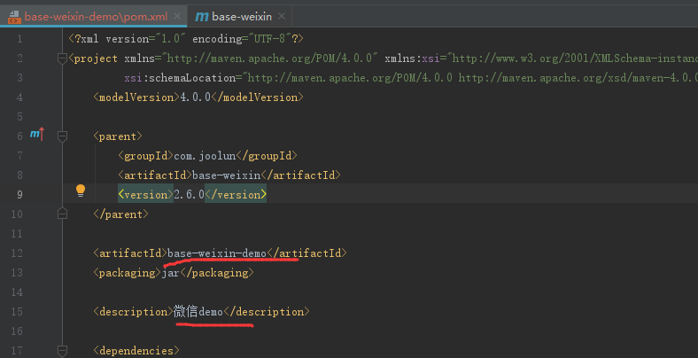
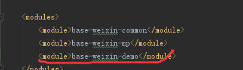
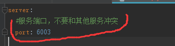
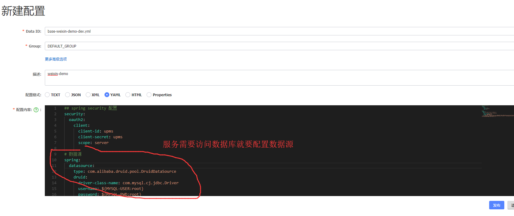
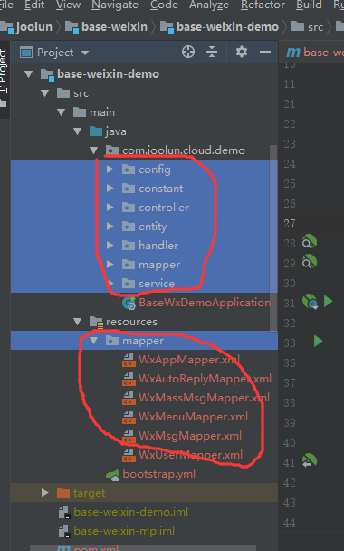
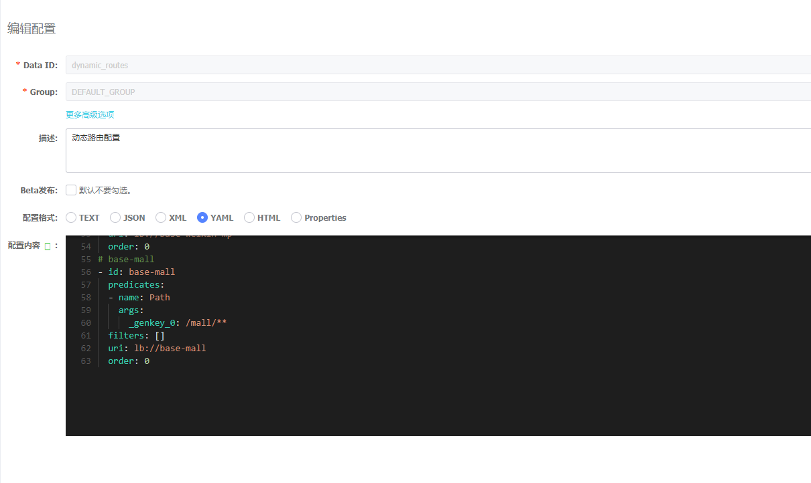
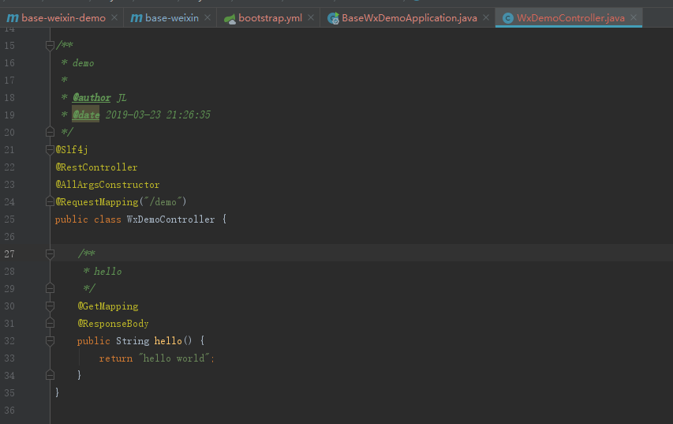
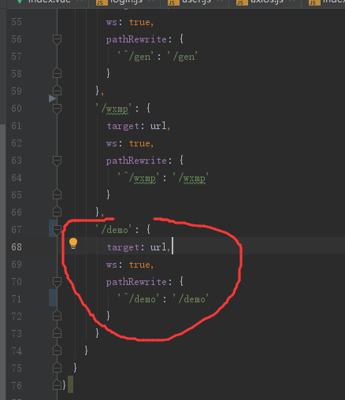

# 如何新建微服务
       假如要在base-weixin下新建一个base-weixin-dome的服务
       
       复制base-weixin-mp命名为base-weixin-demo
       
       com.joolun.cloud包名不要改动，否则系统无法运行
       
       修改模块名wxmp为demo（com.joolun.cloud.demo）
       
       修改pom文件（joolun\base-weixin\base-weixin-demo\pom.xml）
   

    父模块增加子模块配置（joolun\base-weixin\pom.xml）

    修改配置文件（joolun\base-weixin\base-weixin-demo\src\main\resources\bootstrap.yml）

    nacos配置中心新建 base-weixin-demo-dev.yml（http://127.0.0.1:8848/nacos/index.html）

     重命名BaseWxMpApplication为BaseWxDemoApplication（joolun\base-weixin\base-weixin-demo\src\main\java\com\joolun\cloud\demo\BaseWxDemoApplication.java）
    
     删除多余文件
   

    nacos中配置动态路由（dynamic_routes） 模仿base-weixin-mp新增一条路由

    新建测试类（joolun\base-weixin\base-weixin-demo\src\main\java\com\joolun\cloud\demo\controller\WxDemoController.java）

    清空redis缓存
    
    依次启动base-nacos、base-gateway、base-auth、base-upms-admin、base-weixin-demo）
    
    前端配置转发代理（joolun-wx\joolun-ui\vue.config.js）

    启动前端项目
    
    以上完成了新服务的添加，可以配合代码生成器完成相应表的增、删、改、查功能