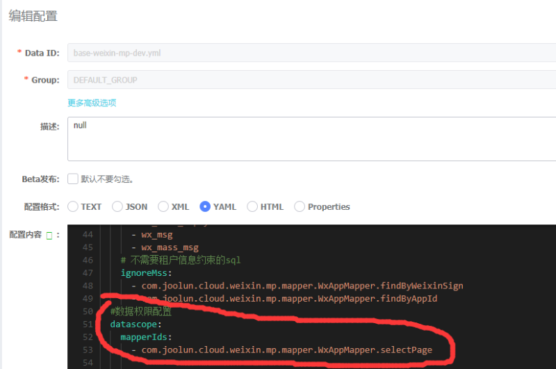

# 通过mybatis拦截器实现数据权限

    摘要：本文主要介绍JooLun框架数据权限的实现原理

例如我要让WxApp（公众号账号）受到数据权限的控制，实现不同机构的用户管理不同的公众号，步骤如下：

>1、wx_app表需要有机构字段（organ_id），因为系统通过机构来划分数据权限的

>2、nacos中配置需要控制数据Mapper方法，这里我配的是分页查询方法（selectPage）

 

>3、修改用户角色的数据权限类型（全部、本级、本级及子级、自定义）

    到此WxApp的数据权限就配置完成了，通过赋给用户角色即可完成不同机构的用户管理不同的公众号
    
>核心代码（DataScopeInterceptor.java）
    
    //查询数据权限配置
    List<String> mapperIds = dataScopeProperties.getMapperIds();
    //未配置数据权限，直接放行
    if (mapperIds==null || mapperIds.size()<=0) {
       return invocation.proceed();
    }else{
       String mappedStatementId = mappedStatement.getId();
       if(!CollUtil.contains(mapperIds,mappedStatementId)){
          return invocation.proceed();
       }
    }