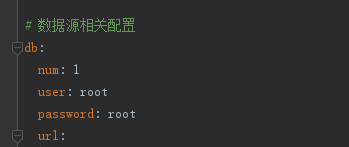

# 开发环境部署教程
## 微信公众号开发－开发环境准备
    windows系统
    IntelliJ IDEA（安装lombok插件） + WebStorm
    MySql8（MySql版本至少5.7或者5.7+，强烈推荐mysql8）
    Redis
    JDK8（版本必需8或者8+）
    maven（后端项目构建管理）
    node（前端构建管理）
    npm
    SwitchHosts（用于修改hosts）

 ### 微信公众号开发－开始部署{docsify-ignore}

    注：请不要有侥幸心理，忽略下面的任何一步，系统就跑不起来，所以请认真阅读
    
>修改hosts

    以管理员的身份运行SwitchHosts!，添加如下配置
   
>本地开发环境
   
    127.0.0.1 base-nacos
    127.0.0.1 base-gateway
    127.0.0.1 base-redis
    127.0.0.1 base-mysql
    
 
 
    用地址base-mysql，看能否连接上MySQL，确保hosts成功修改
    
  
     
    导入数据库（/joolun/db）确保mysql版本在5.7或以上，最好是mysql8
    注意：如果脚本导入报”Unknown collation: 'utf8mb4_0900_ai_ci'“错，请把脚本中的所有”utf8mb4_0900_ai_ci”换成“utf8mb4_bin”，当然你也可以把mysql版本升到8.0.1以上，毕竟8的在性能方面提升很大
   
 ### 后端发布

   >1、idea导入后端代码（/joolun），再安装lombok插件
   
  > 2、修改base-cacos配置文件的数据库密码（/joolun/base-nacos/src/main/resources/bootstrap.yml）
   
 
   
  > 3、首先启动BaseNacosApplication
   
    base-nacos启动成功后
    浏览器中打开http://127.0.0.1:8848/nacos/index.html账号密码：nacos/nacos

>4、修改相关密码

 
 
    application-dev.yml：修改redis密码
    base-auth-dev.yml、base-codegen-dev.yml、base-upms-admin-dev.yml、base-weixin-mp-dev.yml：
    修改mysql账号、密码，将root换成自己的账号密码
    注意冒号后面要带一个空格
        
        

>5、然后依次启动

    BaseGateWayApplication（网关）
    BaseAuthApplication（认证授权）
    BaseAdminApplication（后台管理系统）
    BaseWxMpApplication（微信公众号模块）
    BaseCodeGenApplication（代码生成模块）
 
### 前端发布

    1、WebStorm导入前端代码（/joolun-ui）
    2、npm run install
    
    
    3、npm run serve
     
     

## 后端生产环境部署（centos7）

### 一、服务器安装mysql8、redis（自行百度）{docsify-ignore}

### 二、导入数据库 {docsify-ignore}

     
    

    导入完成后，修改base_config数据库config_info表的配置文件
    

    application-dev.yml：修改redis密码

    base-auth-dev.yml、base-codegen-dev.yml、base-upms-admin-dev.yml、base-weixin-mp-dev.yml：修改mysql账号、密码，将root换成自己的账号密码

### 三、服务器hosts配置 {docsify-ignore}

    # vi /etc/hosts

    127.0.0.1 base-nacos
    127.0.0.1 base-gateway
    127.0.0.1 base-redis
    127.0.0.1 base-mysql
   
   
### 四、修改nacos模块的mysql密码 {docsify-ignore}

    base-nacos\src\main\resources\bootstrap.yml
   
   
### 五、用idea打包 {docsify-ignore}

    mvn clean install -Dmaven.test.skip=true
   
   
### 六、打包完成后，将joolun主目录上传到服务器 {docsify-ignore}
    
   
### 七、cd到joolun主目录 {docsify-ignore}

    # cd /mnt/install/joolun/

### 八、逐个启动 {docsify-ignore}

>启动前清理下redis

>注意启动顺序

    # nohup java -jar base-nacos/target/base-nacos.jar >base-nacos.out &
    # nohup java -jar base-gateway/target/base-gateway.jar >base-gateway.out &
    # nohup java -jar base-auth/target/base-auth.jar >base-auth.out &
    # nohup java -jar base-upms/base-upms-admin/target/base-upms-admin.jar >base-upms.out &
    # nohup java -jar base-weixin/base-weixin-mp/target/base-weixin-mp.jar >base-weixin-mp.out &
    # nohup java -jar base-codegen/target/base-codegen.jar >base-codegen.out &
>启动后可以查看相应服务的日志，看是否有报错

    
   
## 前端生产环境部署（centos7）   

### 一、安装nginx（自行百度） {docsify-ignore}

### 二、用户WebStorm打包 {docsify-ignore}

    npm run build
    
    

### 三、上传打包后的dist文件夹到/mnt/install/joolun-ui/目录下 {docsify-ignore}

    

### 四、修改nginx配置 {docsify-ignore}

>vi /usr/local/nginx/conf/nginx.conf

>讲打包好的dist目录文件，放置到这个目录下
        
        root /mnt/install/joolun-ui/dist/;
              
        location ~* ^/(code|auth|admin|gen|wxmp) {
           proxy_pass http://127.0.0.1:9999;
           #proxy_set_header Host $http_host;
           proxy_connect_timeout 15s;
           proxy_send_timeout 15s;
           proxy_read_timeout 15s;
           proxy_set_header X-Real-IP $remote_addr;
           proxy_set_header X-Forwarded-For $proxy_add_x_forwarded_for;
        }
        
### 五、启动nginx {docsify-ignore}

    systemctl start nginx.service

## 公众号接入教程    
接入方式分为两种：

>一键授权添加（快准恨，需要微信第三方平台账号）
>手动添加配置（配置稍微复杂，不需要微信第三方平台账号）

  

### 第一种一键授权添加：{docsify-ignore}

>1、在微信开放平台中创建第三平台

  

>2、nacos（localhost:8848/nacos/index.html）中配置第三方平台账号

  

>3、 重启相应服务，等待10分钟，等redis中生成"wxopen"

  

>4、第三方平台配置完成后，之后所有公众号可以通过一键授权添加了

  

### 第二种手动添加配置：{docsify-ignore}

>1、点”添加“填写配置信息，需填写的配置信息请到公众平台获取

  

>2、获取接入链接

>3、登录公众平台服务器配置

    token自己定义一个就行了

### 公众平台设置白名单（填入你服务器公网IP）{docsify-ignore}

### 公众平台启用配置{docsify-ignore}

### 接入完成 {docsify-ignore}
