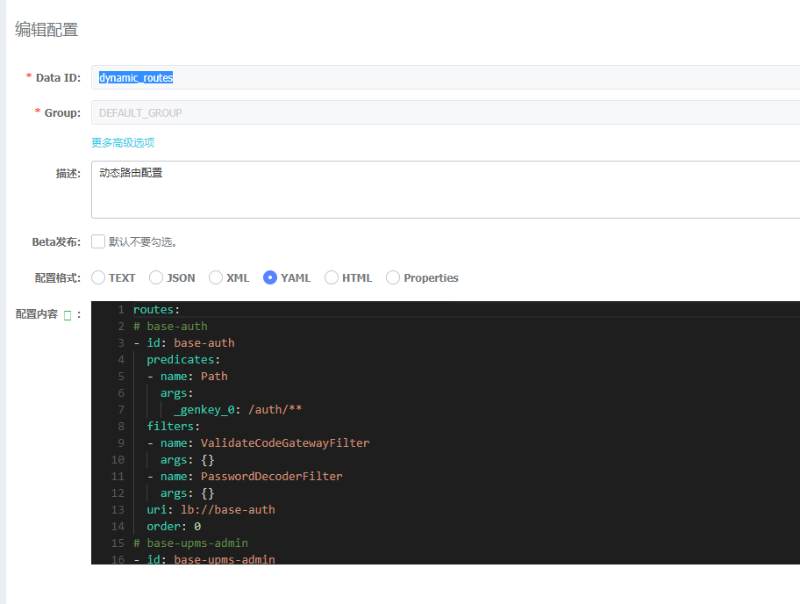

# 使用Nacos实现Spring Cloud Gateway的动态路由

    摘要：本文主要介绍通过本框架中使用Nacos下发路由配置实现Spring Cloud Gateway的动态路由。

前言
        
>网关中有两个重要的概念，那就是路由配置和路由规则，路由配置是指配置某请求路径路由到指定的目的地址。而路由规则是指匹配到路由配置之后，再根据路由规则进行转发处理。 Spring Cloud Gateway作为所有请求流量的入口，在实际生产环境中为了保证高可靠和高可用，尽量避免重启，需要实现Spring Cloud Gateway动态路由配置。

## 1、路由模块（base-gateway）启动时加载路由配置并开启监听实现动态（DynamicRouteInit.java）

 
 
## 2、nacos中配置路由信息（dynamic_routes）

 
 
    动态路由就是这么简单，更新路由配置不再需要重启服务